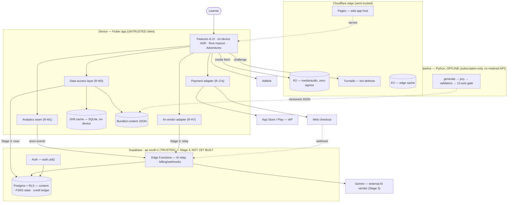

# Stage-4 Threat-Model Worksheet — STRIDE + LINDDUN (workshop companion)

> **Status: PLANNING TEMPLATE ONLY.** Companion to `docs/STAGE4_SIGNOFF_CHECKLIST.md` (Part C). This seeds the threat-modeling session with a first-draft data-flow diagram and blank worksheets for the **owner-assigned senior architects** to complete. It does **not** perform the analysis, begin the sign-off, touch Supabase, or change any decision.
>
> Grounded in `Apps/tasks/SPEC.md` §3 (four tiers + five seams). Stage-3 elements are drawn as **NOT YET BUILT** — the live Supabase project stays untouched.

---

## 1. System data-flow diagram (first draft — refine live)

Trust zones are the subgraph boxes; arrows crossing a box boundary are the flows that most need STRIDE/LINDDUN attention. Dotted arrows are build-time or async.

---

## 2. Element & data-flow inventory

| ID | Element / data-flow | Trust zone | Notes |
|----|---------------------|-----------|-------|
| E1 | Flutter UI / features (+ on-device ASR) | Device | untrusted; ASR audio never leaves device raw (§8) |
| E2 | AI-vendor adapter (R-H7) | Device→Backend | all AI calls funnel here |
| E3 | Analytics seam (R-M1) | Device→Backend | anonymous-first, no PII/raw speech |
| E4 | Payment adapter (R-J7a) | Device→Stores | IAP + web checkout behind one adapter |
| E5 | Data-access layer (R-M3) | Device→Backend | only path to persisted data |
| E6 | Drift cache (SQLite) | Device | on-device only, not the backend |
| E7 | Bundled content JSON | Device | shipped asset; built offline |
| E8 | Cloudflare Pages | Edge | serves the web client |
| E9 | R2 media/audio | Edge | zero-egress CDN object store |
| E10 | Turnstile | Edge | bot defense |
| E11 | KV | Edge | edge cache |
| E12 | Supabase Auth — `auth.uid()` | Backend | the only user PK (R-K6) |
| E13 | Postgres + RLS | Backend | content · FSRS state · credit ledger |
| E14 | Edge Functions | Backend | AI relay · billing webhooks |
| E15 | Gemini | External | called only via E14 |
| E16 | App Store / Play IAP | External | entitlement source |
| E17 | Web checkout | External | entitlement source |
| E18 | AdMob | External | free-tier ads |

---

## 3. STRIDE worksheet (security) — mark applicable, link a finding ID

`▢` = to assess · `—` = N/A · `Fn` = finding id (Part 5)

| Element / flow | Spoof | Tamper | Repudiate | Info-disclose | DoS | Elev-priv |
|----------------|:--:|:--:|:--:|:--:|:--:|:--:|
| E2 AI adapter → relay | ▢ | ▢ | ▢ | ▢ | ▢ | ▢ |
| E3 Analytics → events | ▢ | ▢ | ▢ | ▢ | ▢ | ▢ |
| E4 Payment adapter | ▢ | ▢ | ▢ | ▢ | ▢ | ▢ |
| E5 DAL → Postgres | ▢ | ▢ | ▢ | ▢ | ▢ | ▢ |
| E12 Auth / auth.uid() | ▢ | ▢ | ▢ | ▢ | ▢ | ▢ |
| E13 Postgres + RLS | ▢ | ▢ | ▢ | ▢ | ▢ | ▢ |
| E14 Edge Functions | ▢ | ▢ | ▢ | ▢ | ▢ | ▢ |
| E9/E10/E11 Edge | ▢ | ▢ | ▢ | ▢ | ▢ | ▢ |

Anchor prompts: RLS row-scoping & bypass paths · Edge-Function service-role usage · JWT/`auth.uid()` spoofing · Turnstile coverage · AI-relay & cost caps (DoS, R-M8) · client-supplied content tampering.

---

## 4. LINDDUN worksheet (privacy) — per personal-data flow

| Element / flow | Link | Identify | Non-repud | Detect | Disclose | Unaware | Non-comply |
|----------------|:--:|:--:|:--:|:--:|:--:|:--:|:--:|
| E1 on-device ASR | ▢ | ▢ | ▢ | ▢ | ▢ | ▢ | ▢ |
| E3 analytics events | ▢ | ▢ | ▢ | ▢ | ▢ | ▢ | ▢ |
| E5 DAL learner state | ▢ | ▢ | ▢ | ▢ | ▢ | ▢ | ▢ |
| E13 Postgres records | ▢ | ▢ | ▢ | ▢ | ▢ | ▢ | ▢ |

Anchor prompts: pseudonymous `user_id` only (no linkability) · anonymous-first events (R-M1) · **never persist raw audio/voiceprints** (§8) · data minimization & retention · consent/transparency · general-audience listing (R-K1) · GDPR/COPPA · residency `ap-south-1`.

---

## 5. Findings register (fill during the session)

| ID | Element | Category | Threat | Mitigation | Owner | Severity | Status |
|----|---------|----------|--------|------------|-------|:--:|:--:|
| _F1 (example)_ | E13 | STRIDE-E | RLS policy gap exposes another user's rows | deny-by-default RLS + per-table policy tests | _tbd_ | P0 | open |
| _F2 (example)_ | E3 | LINDDUN-I | event payload carries a PII field | enforce taxonomy allow-list at the seam | _tbd_ | P1 | open |
| | | | | | | | |

**Gate rule:** every **P0/P1** finding has a named mitigation **before** any Stage-3 code begins (checklist Part C).

---

## 6. How to run the session (≈90 min)

1. Walk the diagram (§1); correct it to reality; mark every boundary-crossing flow.
2. STRIDE pass per element (§3) → log findings to §5.
3. LINDDUN pass per personal-data flow (§4) → log findings to §5.
4. Resolve/assign all P0/P1; attach the completed diagram + tables to the checklist.
5. Then proceed to checklist Part D (`pg_dump` diff = 0) and Part E (dual sign-off).

*Prepared as a planning aid (Session 17). No analysis performed, no decisions changed, no sign-off performed. Canonical copy: repo `docs/`; owner mirror: `Apps/RATEL_STAGE4_THREATMODEL_WORKSHEET.md`.*
